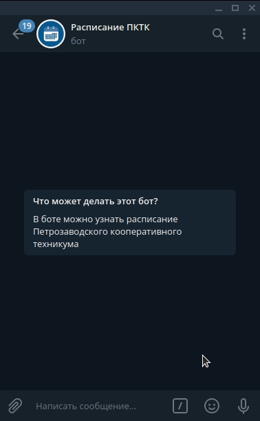

# ScheduleBotTelegram
> Бот для Telegram, который отправляет расписание пар Петрозаводского кооперативного техникума.
> Бот написан на Python, с использованием библиотеки aiogram и базы данных PostgreSQL.
> Данного бота можно добавить к себе в телеграм, перейдя по ссылке: @PKTK_schedule_bot

## Демо


## Начало
1. Клонируйте репозиторий.
2. В /ScheduleBotTelegram/ добавьте файл .env (рядом с app.py и loader.py) (путь к .env: /ScheduleBotTelegram/.env)
3. Настройте .env:
```
BOT_TOKEN= 123123asdbahsbdhb # Токен вашего бота
ADMIN_ID= 6736732864 # Ваш ID в Telegram
ip= 17.01.20.10 # Ваш IP
PG_USER= postgres # Ваш пользователь в PostgreSQL
PG_PASSWORD=passwd # Ваш пароль от пользователя postgresql
DATABASE=gino # Ваша база данных в PostgreSQL
```
4. В /ScheduleBotTelegram/data/ добавьте ключ-пару от гугл таблиц в формате .json. Как получить эту ключ-пару объяснено в этом видео: https://www.youtube.com/watch?v=Bf8KHZtcxnA&t=232s (путь к key.json: /ScheduleBotTelegram/data/key.json)
5. Измените пути к файлам в зависимости от вашей операционной системы и названия ваших директорий. Например в файле /ScheduleBotTelegram/handlers/users/start.py изменить путь в этой строке: 
```
file_name_group = open("/home/alien/PycharmProjects/ScheduleBotTelegram/data/name_groups.txt")
```
6. Скачать PostgreSQL и зайти в pgAdmin. Там создать сервер с такими настройками:


